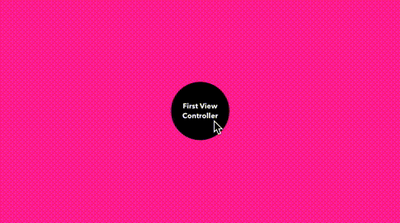

# TransitioningKit

###### PRERELEASE

 

TransitioningKit is a Swift framework providing a set of components for simplifying, clarifying, & standardizing the implemention of custom Navigation & View Controller transitions.

TransitioningKit currently provides three commonly needed public classes, and one public protocol:

- **[PSNavigationControllerDelegate](#psnavigationcontrollerdelegate)**
- **[PSViewControllerTransitioningDelegate](#psviewcontrollertransitioningdelegate)**
- **[PSPanGestureInteractionController](#pspangestureinteractioncontroller)**
- **[PSPanGestureInteractionControllerDelegate](#pspangestureinteractioncontrollerdelegate)**


### PSNavigationControllerDelegate
**A concrete implementation of the [UINavigationControllerDelegate](https://developer.apple.com/library/ios/documentation/UIKit/Reference/UINavigationControllerDelegate_Protocol/) protocol.**

- [Source Code](TransitioningKit/PSNavigationControllerDelegate.swift)
- [Example Usage](https://github.com/puffinsupply/TransitioningKit/blob/master/Example/Example/FirstViewController.swift#L18-L21)


When assigned to the `delegate` property of a *UINavigationController*, *PSNavigationControllerDelegate* assumes the responsibility of vending *[UIViewControllerAnimatedTransitioning](https://developer.apple.com/library/ios/documentation/UIKit/Reference/UIViewControllerAnimatedTransitioning_Protocol/)* (“animator”) and *[UIPercentDrivenInteractiveTransition](https://developer.apple.com/library/ios/documentation/UIKit/Reference/UIPercentDrivenInteractiveTransition_class/)* (“interaction controller”) objects for `push` and `pop` transitions.


### PSViewControllerTransitioningDelegate
**A concrete implementation of the [UIViewControllerTransitioningDelegate](https://developer.apple.com/library/ios/documentation/UIKit/Reference/UIViewControllerTransitioningDelegate_protocol/) protocol.**

- [Source Code](TransitioningKit/PSViewControllerTransitioningDelegate.swift)
- [Example Usage](https://github.com/puffinsupply/TransitioningKit/blob/master/Example/Example/SecondViewController.swift#L17-L20)

Similar to *PSNavigationControllerDelegate*, when assigned to the `transitioningDelegate` property of a *UIViewController*, *PSViewControllerTransitioningDelegate* assumes the responsibility of vending *[UIViewControllerAnimatedTransitioning](https://developer.apple.com/library/ios/documentation/UIKit/Reference/UIViewControllerAnimatedTransitioning_Protocol/)* (“animator”), *[UIPercentDrivenInteractiveTransition](https://developer.apple.com/library/ios/documentation/UIKit/Reference/UIPercentDrivenInteractiveTransition_class/)* (“interaction controller”), and *[UIPresentationController](https://developer.apple.com/library/ios/documentation/UIKit/Reference/UIPresentationController_class/)* (“presentation controller”) objects for `present` and `dismiss` transitions.


### PSPanGestureInteractionController

**A subclass of [UIPercentDrivenInteractiveTransition](https://developer.apple.com/library/ios/documentation/UIKit/Reference/UIPercentDrivenInteractiveTransition_class/).**

- [Source Code](TransitioningKit/PSPanGestureInteractionController.swift)
- [Example Usage](https://github.com/puffinsupply/TransitioningKit/blob/master/Example/Example/FirstViewController.swift#L16)

`PSPanGestureInteractionController` coordinates a `UIPanGestureRecognizer` to simplify implementation of common gesture driven interactive transitions. It includes simple a delegate protocol which you implement to customize behavior for your application.


### PSPanGestureInteractionControllerDelegate

**A custom protocol for handling `PSPanGestureInteractionController` events within your application.**

- [Source Code](https://github.com/puffinsupply/TransitioningKit/blob/master/TransitioningKit/PSPanGestureInteractionController.swift#L27-L37)
- [Example Usage](https://github.com/puffinsupply/TransitioningKit/blob/master/Example/Example/FirstViewInteractionControllerDelegate.swift)


## Example



Here we have a simplified example of transitioning between three view controllers.

##### 1. First View Controller → Second View Controller

In this instance, we are seeing a custom, interactive, “push” operation between these two view controllers. Here are the parts involed in this operation:

1. [FirstViewToSecondViewPushAnimator](https://github.com/puffinsupply/TransitioningKit/blob/master/Example/Example/FirstViewToSecondViewPushAnimator.swift) implements the animation.
2. [FirstViewInteractionControllerDelegate](https://github.com/puffinsupply/TransitioningKit/blob/master/Example/Example/FirstViewInteractionControllerDelegate.swift) handles the pan gesture.
3. `PSPanGestureInteractionController` [is instantiated](https://github.com/puffinsupply/TransitioningKit/blob/master/Example/Example/FirstViewController.swift#L16) with `FirstViewInteractionControllerDelegate`.
4. `PSNavigationControllerDelegate` [is instantiated](https://github.com/puffinsupply/TransitioningKit/blob/master/Example/Example/FirstViewController.swift#L18-L21) with the interaction controller and the animator.
5. `PSNavigationControllerDelegate` [is assigned](https://github.com/puffinsupply/TransitioningKit/blob/master/Example/Example/FirstViewController.swift#L23) as the navigation controller `delegate`.

##### 2. Second View Controller → Third View Controller

In this instance, we are seeing a modal “present” & “dismiss” operation between these two view controllers.

1. [ThirdViewControllerPresentAnimator](https://github.com/puffinsupply/TransitioningKit/blob/master/Example/Example/ThirdViewControllerPresentAnimator.swift) and [ThirdViewControllerDismissAnimator](https://github.com/puffinsupply/TransitioningKit/blob/master/Example/Example/ThirdViewControllerDismissAnimator.swift) implement the animations.
2. `PSViewControllerTransitioningDelegate` [is instantiated](https://github.com/puffinsupply/TransitioningKit/blob/master/Example/Example/SecondViewController.swift#L17-L20) with the animators.
3. `PSViewControllerTransitioningDelegate` [is assigned](https://github.com/puffinsupply/TransitioningKit/blob/master/Example/Example/SecondViewController.swift#L17-L20) to as the modal view controller's `transitioningDelegate`.

## Installation

### Carthage

Add the following to your project's `Cartfile`:

```swift
github "puffinsupply/TransitioningKit" >= 0.0.1
```

## License

- [MIT](http://thi.mit-license.org/)


